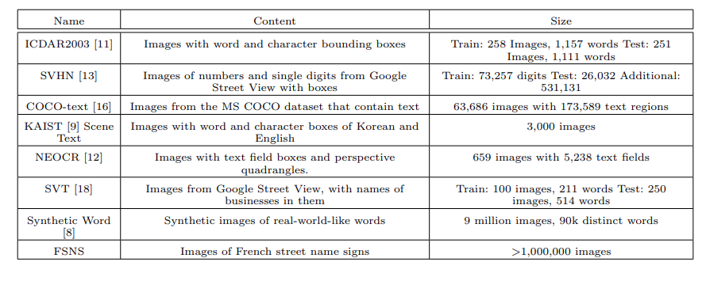

# Octo-fsns-data-generate
Generating the dataset for fsns (attention ocr) Deep Networks, End-to-end Networks, Image Dataset, Multiview Dataset

Google officials did not say in this part carefully, only to a stackoverflow link, but This link is also not clear,and have some mistakes, so I wrote a code to generate FSNS format (JPG / PNG) tfrecord .

## About FSNS

FSNS dataset is a set of signs, from the streets of France, that bear street names. Some example images are shown in Figure 1. Each image carries four tiles of 150 × 150 pixels laid out horizontally, each of which contains a pre-detected street name sign, or random noise in the case that less than four independent views are available of the same physical sign

## Ground truth

## How created fsns

1. A street-name-sign detector was applied to all Google Street View images from France. The
detector returns an image rectangle around each street name sign, together with its geographic
location (latitude and longitude).
2. Multiple images of the same geographic location were gathered together (spatially clustered).
3. Text from the signs was transcribed using a combination of reCAPTCHA [3], OCR and human
operators.
4. Transcribed text was presented to human operators to verify the accuracy of the transcription.
Incorrect samples were re-routed for human transcription (back to step 3) or discarded if already
the result of a human transcription.
5. Images were bucketized geographically (by latitude/longitude) so that the train, validation, test,
and private test sets come from disjoint geographic locations, with 100 m wide strips of “wall” in
between that are not used, to ensure that the same physical sign can’t be viewed from different
sets.
6. Since roads are long entities that may pass between the disjoint geographic sections, there may be
multiple signs of the same street name at multiple locations in different subsets. Therefore as each
subset is generated, any images with truth strings that match a truth string in any previously
generated subset are discarded. Each subset thereby has a disjoint set of truth strings.
7. All images for which the truth string included a character outside of the chosen encoding set, or
for which the encoded label length exceeded the maximum of 37, were discarded. The character
set to be handled is thus carefully controlled.